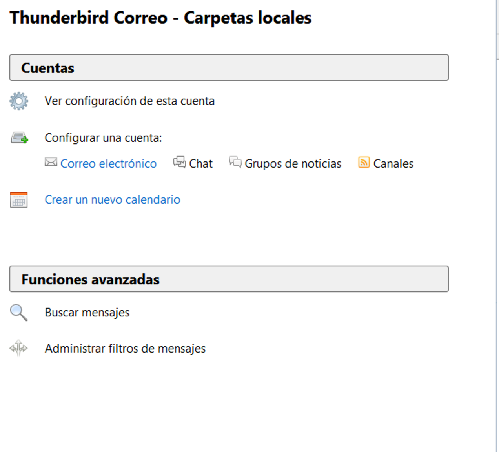
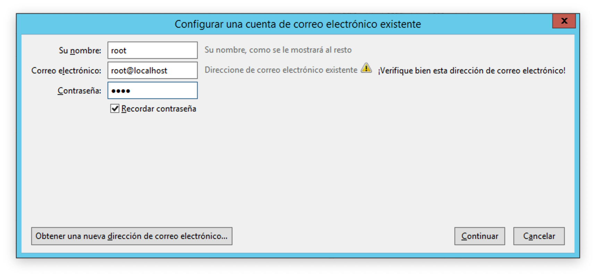

# Servidor Mercury
Conexión de servidor Mercury desde localhost con cliente Thunderbird

## Requisitos
- **[XAMPP](https://www.apachefriends.org/es/index.html)**
- **[Thunderbird](https://www.thunderbird.net/es-ES/)**

## Pasos
1. Ejecutar `XAMPP`

3. Iniciar el servicio de `Mercury`

4. Abrir **Configuration** en `Mercury`

5. En el menú de **Configuration** seleccionar **Manage local users...**

6. Seleccionar **Add**

7. Añadir el usuario **root**
  - *Username* **root**
  - *Personal name* **root**
  - *Mail password* **root**
  - [x] *Administrator privileges*

9. Añadir mas usuarios para interactuar

10. Abirir `Thunderbird` seleccionar  **Confgurar una cuenta**

11. Se abrira una ventana similar

12. Llenar los datos creados anteriormente

13. Dar click en **Continuar**

14. Marcar la casilla:
  - [x] POP3

12. Aceptar la advertencia

13. Aprecerá una nueva carpeta con el usuario que acabamos de agregar *root*

14. Repetir el paso **10** para los otros usuarios

15. Comenzar a enviar correos

16. En la carpeta del destinatario (a quien se envió el correo) dar click en el botón **Recibir mensajes**

17. Apreceran los mensajes recibidos por esa cuenta

